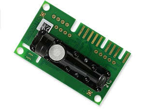

[](https://www.epluse.com/en/)

# EE894 I2C with Raspberry Pi 

|Standard | Compact|
|------------ | ------------|
| | |


[](https://www.epluse.com/en/products/co2-measurement/co2-sensor/ee894/)   [](https://downloads.epluse.com/fileadmin/data/product/ee894/datasheet_EE894.pdf) 


## QUICK START GUIDE  

### Components 
- EE894
- Raspberry Pi 4
- Breadboard 
- Wire jumper cable <br>

| Step |                                                                                                                                                             |
|------|-------------------------------------------------------------------------------------------------------------------------------------------------------------|
| 1    | Connect the EE894 sensor module with Raspberry Pi according to the following scheme: <br>  __Standard:__ [](images/EE894_rpi.png)  __Compact:__ [](images/EE894_comp_rpi.png) |
| 2    | Download and install the operating system (https://www.raspberrypi.org/software/operating-systems/).                                                            |
| 3    | Boot Raspberry Pi and complete any first-time setup if necessary (find instructions online).  
| 4    | Activate I2C communication:https://github.com/fivdi/i2c-bus/blob/master/doc/raspberry-pi-i2c.md                     |
| 5    | Download and install the "smbus2" library on the Raspberry Pi. [Instruction](https://pypi.org/project/smbus2/#:~:text=Installation%20instructions)            |
| 6    | Clone the repository: ```git clone https://github.com/EplusE/ee894_i2c_rpi.git```             |
| 7    | Open a command shell and type following command to receive measurement data – that’s it!  |


### Example request and output

```shell
pi@raspberrypi:~ $ python3 ee894_i2c_rpi.py
	temperature, relative humidity, CO2 average, CO2 raw, pressure
	23.41 °C, 50.64 %RH, 500 ppm, 500 ppm, 978.1 mbar 
```
<br>

## License 
See [LICENSE](LICENSE).